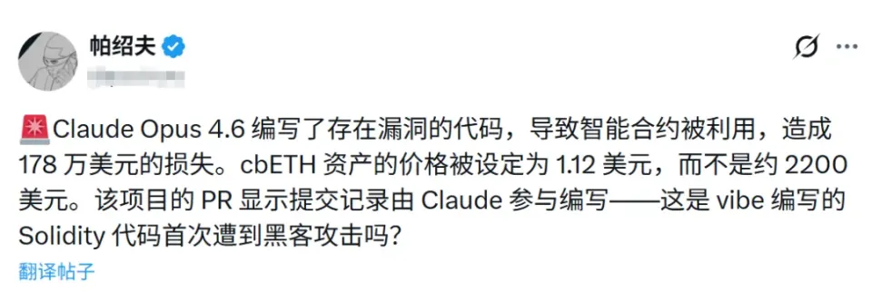
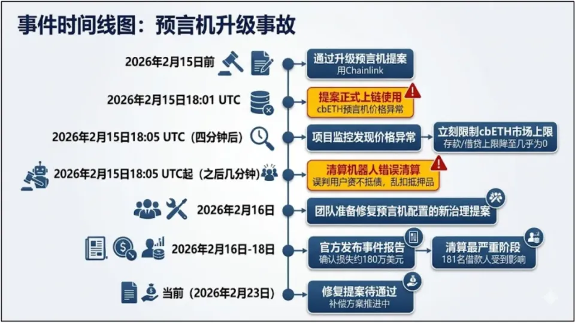
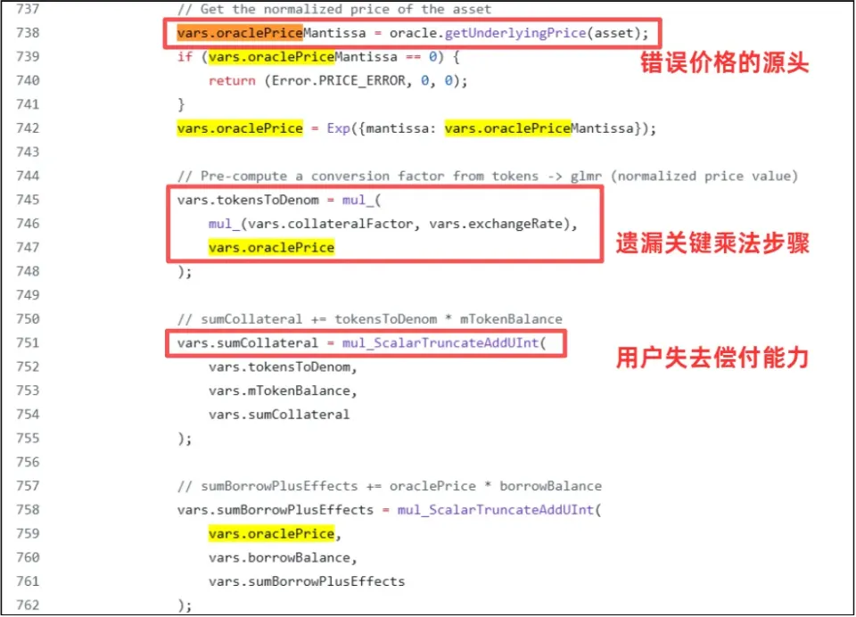

# Code_Security_0402
## Moonwell DeFi协议因AI生成代码逻辑错误损失178万美元(智能合约安全 对应报告5.2节)
### 
2026年2月，DeFi借贷协议Moonwell因智能合约漏洞遭遇重创，损失高达178万美元。

这是业内首起由Vibe Coding（AI辅助编码）引发的链上安全事故，其核心是一个低级却致命的预言机配置漏洞，其中预言机是一种数据在被提交到区块链前的一种获取实时数据的工具。这一事件的根源在于Claude Opus 4.6版本编写的代码存在缺陷，导致项目中的cbETH价格被错误设置为1.12美元，而实际应为约2,200美元。此事件不仅暴露了智能合约审计的重要性，更引发了对“氛围编码（vibe-coding）”现象的关注。

智能合约在区块链技术中扮演着至关重要的角色，作为自动执行合约条款的代码，它的安全性直接关系到资金的安全。然而，Moonwell的这一事件提醒我们，即便是小小的编码失误，也可能导致巨大的财务损失。慢雾创始人余弦指出，此次事件是由于预言机喂价公式的低级错误引发的，这种错误的成本不仅仅是金钱，更多的是对项目信誉的损害。

Claude Opus 4.6的代码提交显示了“氛围编码”的潜在风险。所谓“氛围编码”，是指在缺乏严谨审核的情况下，开发者凭借直觉和经验进行编码，这种方式虽然在某些情况下能快速推动项目进展，但同时也埋下了安全隐患。此次在AI工具Claude生成的代码中，由于缺乏完善的逻辑校验，误将cbETH的价格源直接指向了cbETHETH_ORACLE。该数据源仅能提供cbETH与ETH的“兑换汇率”（即1.12），却无法获取ETH的美元价格。

这个遗漏了关键乘法步骤的错误，导致程序直接将“汇率”视为了“美元价值”。原本价值2400多美元的资产，在系统中被错误地标记为1.12美元，严重低估了99.9%以上，价格相差近2000倍。

在此事件中，智能合约审计员pashov通过社交媒体披露了这一漏洞，进一步引发了行业内对智能合约安全性审计的讨论。随着DeFi领域的不断扩展，如何确保智能合约的安全性已成为行业亟待解决的问题。许多项目开始意识到，单纯依赖自动化工具进行代码审计是不够的，人工审核和多重验证机制同样重要。

总结而言，Moonwell的事件是一个深刻的教训，提醒我们在推动技术进步的同时，绝不能忽视安全性。随着区块链技术的不断演进，开发者和项目方应当加强代码审计和安全管理，以保障用户的资金安全，并提升整个行业的信任度。

## 关联报告风险点

对应《AI生成代码在野安全风险研究报告》第3章 3.2节 3.3节（直接风险：代码幻觉，间接风险：安全文化侵蚀：自动化偏见）

该案例中对应3.2节，AI幻觉生成了语法正确但是金融逻辑致命的定价公式，这不是注入类漏洞，而是AI未能充分理解相应的底层业务逻辑，其未能理解预言机喂价的核心安全约束（价格必须接近市场公允价值），从而导致价值数千万美元的资产定价出现百万倍级错误。

该案例中对应3.3节，此事件中开发者完全信任AI代码的输入输出，忽略了对关键金融逻辑的人工审查，未能对市场定价进行及时监控，源于AI对开发者心中造成的安全文化侵蚀，过度信任AI的效果。

[1] AI写代码翻车了：别再神化AI，Claude编码造成DeFi平台损失178万美元: https://news.qq.com/rain/a/20260311A07MS000.

[2] 智能合约漏洞致Moonwell损失178万美元，教训深刻！ : https://www.sohu.com/a/988223683_122066678.
